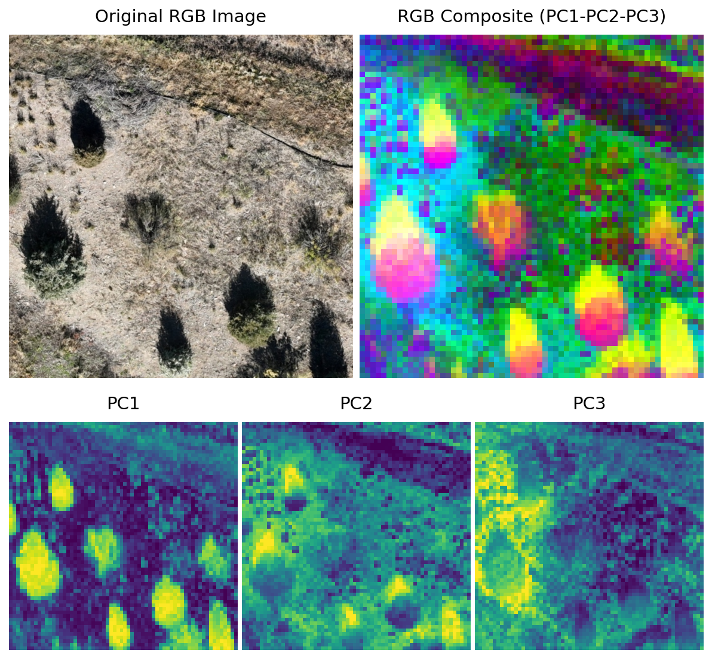

# DINOv3 Satellite Feature Visualization

A repo to explore the DINOv3 checkpoint trained on satellite imagery using PCA visualization.



## Requirements

**Python Version:** 3.12.11

### Critical Version Notes
⚠️ **transformers version is critical** - The satellite DINOv3 model (`facebook/dinov3-vitl16-pretrain-sat493m`) requires the development version of transformers (4.56.0.dev0) for proper compatibility.

## Installation

1. **Install transformers development version first:**
```bash
pip install git+https://github.com/huggingface/transformers.git@main
```

2. **Install other dependencies:**
```bash
pip install -r requirements.txt
```

### Exact Dependency Versions
```
torch==2.7.1
torchvision==0.22.0
transformers==4.56.0.dev0
datasets==3.6.0
scikit-learn==1.7.1
matplotlib==3.10.5
numpy==2.3.2
Pillow==11.3.0
```

## Usage

```bash
python visualize_features.py
```

The script will:
1. Load the satellite dataset
2. Initialize the DINOv3 satellite model
3. Extract features and perform PCA analysis
4. Generate visualizations saved to `results/pca_features.png`
